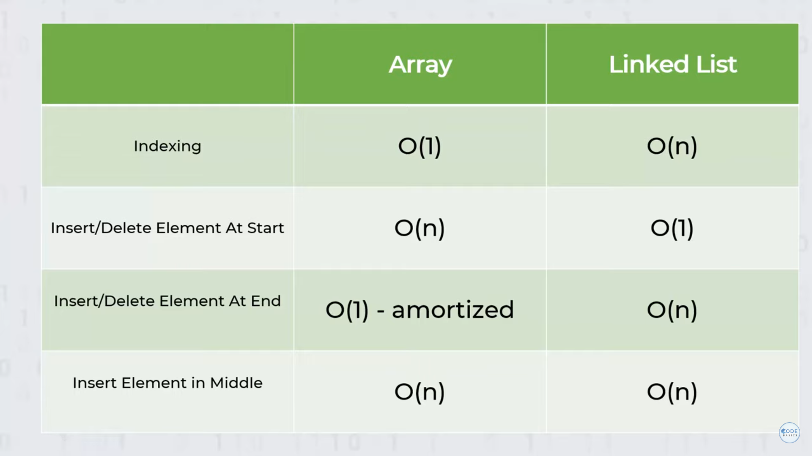

## Basic Data Structures
# Arrays
"""
A linear data structure that can hold elements and arrange them. 
Uses contiguous memory space to store elements. 
Can directly access any element based on its index which makes it an EFFICIENT data structure FOR LOOK UPS. 
Arrays have two types: one-dimensional and multi-dimensional.

In Python list() is of type DYNAMIC ARRAY (some langugaes like Java and C++ have both STATIC ARRAYs)
STATIC ARRAYs - have a fixed length - allocates specific memory for that size
DYNAMIC ARRAYs - variable length - allocates specific amount of memory initially. If you need more - allocates 1 new memory capacity (current capacity*2 extra - gets X3 BIGGER EACH TIME) - then moves all elememnts to new area - has OVERHEAD
Data is stored in RAM, not internal storage.
Address of each stored in hexidecimal in RAM

Advantage - 
1) Speed to LOOK UP element BY INDEX (one advantage Arrays have over Linked Lists)
O(1) to look up element by index x e.g. arr[4]

Disadvantage - 
1) Speed to LOOK UP element BY VALUE
O(n) to look up element by specific value x e.g. for i in range(len(arr)): if arr[i] == 207...

2) INSERT/REMOVE new element at specific index e.g. arr.insert(2, 245)
O(n) as all elements after element n need to be shifted 1 down

3) Can have big memory overhead if needed to add 1 value above allocated memory (see note above about x3 memory requirement)

Good if want to store fixed length data and look up often by index but not modify.
"""

#Linked Lists
"""
Addresses a lot of the inefficiencies of Arrays.
A type of data structure used for storing collections of data. 
Data is stored in nodes, each of which contains a data field and a reference (link) to the next node in the sequence. 
Structurally, a linked list is organized into a sequence or chain of nodes. 
Two types of linked lists are commonly used: SINGLY LINKED LISTS, where each node points to the next node and the last node points to null, and DOUBLEY LINKED LISTS, where each node has two links, one to the previous node and another one to the next. 
Used in other types of data structures like STACKS and QUEUES.

Advantage -
1) Don't need to preallocate space.

2) Fast to insert/delete value to beginning of linked list.
O(1)

3) Easier and memory efficient to insert/delete value in middle/end of linked list - no need to copy and move all following values, - just change stored pointed of previous link to inserted one.
O(n) - needs to traverse list from beginning to find right node pointer

Disadvantage - 
1) Slower to traverse than Array. Need to go through whole list to find value/index
O(n)

"""
